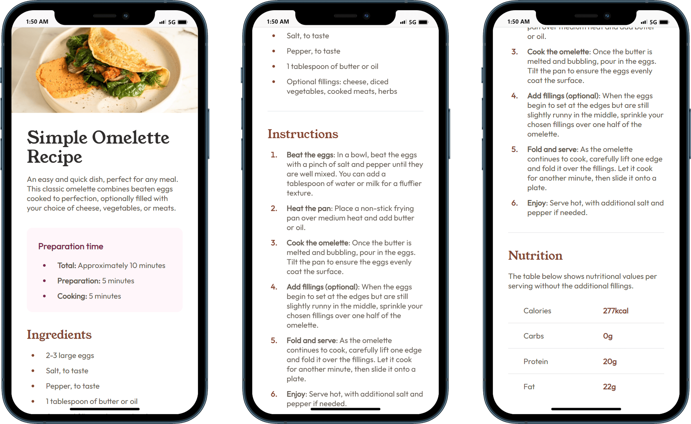

# Frontend Mentor - Recipe page solution

This is a solution to the [Recipe page challenge on Frontend Mentor](https://www.frontendmentor.io/challenges/recipe-page-KiTsR8QQKm). Frontend Mentor challenges help you improve your coding skills by building realistic projects.

## Table of contents

- [Overview](#overview)
  - [Screenshots](#screenshots)
  - [Links](#links)
- [Getting started](#getting-started)
- [My process](#my-process)
  - [Built with](#built-with)
  - [Deployed with](#deployed-with)
- [Author](#author)

## Overview

### Screenshots

- Phone:
  

- Laptop/Desktop:
  

### Links

- Solution URL: [frontend-mentor-solution](https://www.frontendmentor.io/solutions/responsive-recipe-page-with-semantic-html-_F0BGyruOD)
- Live Site URL: [recipe-page](https://recipe-page-nine-beta.vercel.app/)

## Getting started

Clone the project and run the following command:

```console
yarn install
```

This will initialize the project by installing all the required dependencies.

## My process

### Built with


- Semantic HTML5 markup
- Tailwind CSS
- Flexbox
- Parcel bundler
- Mobile-first workflow

### Deployed with


## Author

- Github - [@ddZ6ii](https://github.com/ddZ6ii)
- Frontend Mentor - [@ddZ6ii](https://www.frontendmentor.io/profile/ddZ6ii)
- Linkedin - [@denis-dezest](https://www.linkedin.com/in/denis-dezest/)
